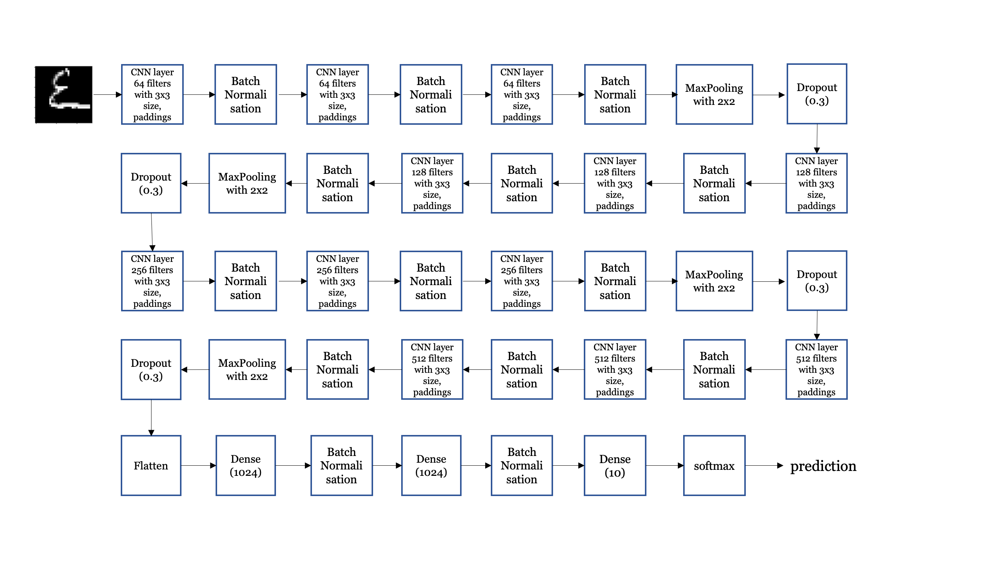

## Kaggle - Kannada MNIST Competition 

** My results ** 
  Private leaderboard = 26th (top 3%) with 0.99120
  Public leaderboard = 16th (top 2%) with 0.99100

All details of the dataset curation has been captured in the paper titled: Prabhu, Vinay Uday. "Kannada-MNIST: A new 
handwritten digits dataset for the Kannada language." arXiv preprint arXiv:1908.01242 (2019)

Also, you can find details - evaluation, requirements, and leaderboard about the competition in https://www.kaggle.com/c/Kannada-MNIST

## Notebook Flow
1) Defining file paths
2) Loading data
3) Data preprocessing
4) Convolutional Neural Network (CNN) Architecture
5) Defining keras Callbacks
6) Image augmentation
7) Training network
8) Predictions on Dig and test data sets

## CNN Architecture

